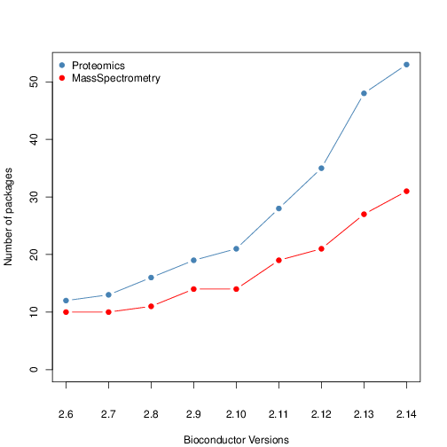
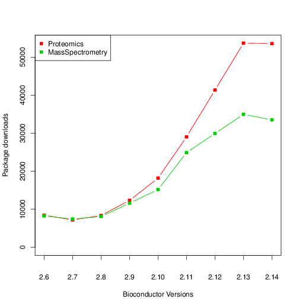

```{r env, echo=FALSE, message=FALSE}
.cache <- FALSE
suppressPackageStartupMessages(library("BiocStyle"))
suppressPackageStartupMessages(library("MSnbase"))
suppressPackageStartupMessages(library("BiocParallel"))
suppressPackageStartupMessages(library("BiocInstaller"))
suppressPackageStartupMessages(library("RforProteomics"))
suppressPackageStartupMessages(library("lattice"))
suppressPackageStartupMessages(library("gridExtra"))
```

**Modified:** `r file.info("lab.Rmd")$mtime`<br />
**Compiled**: `r date()`


**Abstract** In this workflow, we will use R/Bioconductor packages to
explore, process, visualise and understand mass spectrometry-based
proteomics data, starting with raw data, and proceeding with
identification and quantitation data, discussing some of their
peculiarities compared to sequencing data along the way. The workflow
is aimed at a beginner to intermediate level, such as, for example,
seasoned R users who want to get started with mass spectrometry and
proteomics, or proteomics practitioners who want to familiarise
themselves with R and Bioconductor infrastructure.

> This material available under a
> [**creative common CC-BY**](http://creativecommons.org/licenses/by/4.0/)
> license. You are free to **share** (copy and redistribute the
> material in any medium or format) and **adapt** (remix, transform,
> and build upon the material) for any purpose, even commercially.

# Introduction

In recent years, there we have seen an increase in the number of
packages to analyse mass spectrometry and proteomics data for R and
Bioconductor, as well as an increase in total number of downloads.




This workflow illustrates R / Bioconductor infrastructure for
proteomics. Topics covered focus on support for open community-driven
formats for raw data and identification results, packages for
peptide-spectrum matching, data processing and analysis:

- Exploring available infrastructure
- Mass spectrometry data
- Getting data from proteomics repositories
- Handling raw MS data
- Handling identification data
- MS/MS database search
- Analysing search results
- High-level data interface
- Quantitative proteomics
- Importing third-party quantitation data
- Data processing and analysis
- Statistical analysis
- Machine learning
- Annotation
- Other relevant packages/pipelines

Links to other packages and references are also documented. In
particular, the vignettes included in the
`r Biocannopkg("RforProteomics")`
package also contains relevant material.

## Setup { - }

The follow packages will be used throughout this documents. R version
`3.3.1` or higher is required to install all the packages using
`BiocInstaller::biocLite`.

```{r setup, message=FALSE, echo=TRUE, warning=FALSE}
library("mzR")
library("mzID")
library("MSnID")
library("MSnbase")
library("rpx")
library("MLInterfaces")
library("pRoloc")
library("pRolocdata")
library("MSGFplus")
library("rols")
library("hpar")
```

The most convenient way to install all the tutorials requirement (and
more related content), is to install `r Biocannopkg("RforProteomics")`
with all its dependencies.

```{r r4pinstall, eval=FALSE}
library("BiocInstaller")
biocLite("RforProteomics", dependencies = TRUE)
```

Other packages of interest, such as
`r Biocpkg("rTANDEM")` or `r Biocpkg("MSGFgui")` 
will be described later in the document but are not required to
execute the code in this workflow.


## Exploring available infrastructure { - }

```{r pk, echo=FALSE, warning=FALSE, cache=TRUE}
biocv <- as.character(biocVersion())
pp <- proteomicsPackages(biocv)
msp <- massSpectrometryPackages(biocv)
msdp <- massSpectrometryDataPackages(biocv)
```

In Bioconductor version `r biocv`, there are respectively `r nrow(pp)`
[proteomics](http://bioconductor.org/packages/release/BiocViews.html#___Proteomics),
`r nrow(msp)`
[mass spectrometry software packages](http://bioconductor.org/packages/release/BiocViews.html#___MassSpectrometry)
and `r nrow(msdp)`
[mass spectrometry experiment packages](http://bioconductor.org/packages/release/BiocViews.html#___MassSpectrometryData). These
respective packages can be extracted with the `proteomicsPackages()`,
`massSpectrometryPackages()` and `massSpectrometryDataPackages()` and
explored interactively, or looked at by exploring the respective
`biocViews` on the
[Bioconductor web page](https://bioconductor.org/packages/release/BiocViews.html#___Software).


```{r pp, eval=FALSE}
library("RforProteomics")
pp <- proteomicsPackages()
display(pp)
```

## Mass spectrometry data { - }

Most community-driven formats described in the table are supported in
`R`. We will see how to read and access these data in the following
sections.

```{r datatab, results='asis', echo=FALSE}
datatab <-
    data.frame(Type = c("raw", "identification", "quantitation",
                   "peak lists", "other"),
               Format = c("mzML, mzXML, netCDF, mzData",
                   "mzIdentML", "mzQuantML", "mgf", "mzTab"),
               Package = c(
                   "*[mzR](http://bioconductor.org/packages/mzR)* (read)",
                   paste("*[mzR](http://bioconductor.org/packages/mzR)* (read) and",
                         "*[mzID](http://bioconductor.org/packages/mzID)* (read)"),
                   "",
                   "*[MSnbase](http://bioconductor.org/packages/MSnbase)* (read)", 
                   "*[MSnbase](http://bioconductor.org/packages/MSnbase)* (read)"))
library("knitr")
kable(datatab)
```

# Accessing data

## From the ProteomeXchange database

MS-based proteomics data is disseminated through the
[ProteomeXchange](http://www.proteomexchange.org/) infrastructure,
which centrally coordinates submission, storage and dissemination
through multiple data repositories, such as the
[PRoteomics IDEntifications (PRIDE)](https://www.ebi.ac.uk/pride/archive/)
database at the EBI for mass spectrometry-based experiments (including
quantiative data, as opposed as the name suggests),
[PASSEL](http://www.peptideatlas.org/passel/) at the ISB for SRM data
and the
[MassIVE](http://massive.ucsd.edu/ProteoSAFe/static/massive.jsp)
resource. These data can be downloaded within R using the
`r Biocpkg("rpx")` package.


```{r rpx}
library("rpx")
pxannounced()
```

Using the unique `PXD000001` identifier, we can retrieve the relevant
metadata that will be stored in a `PXDataset` object. The names of the
files available in this data can be retrieved with the `pxfiles`
accessor function.

```{r pxd}
px <- PXDataset("PXD000001")
px
pxfiles(px)
```

Other metadata for the `px` data set:

```{r pxvar}
pxtax(px)
pxurl(px)
pxref(px)
```

Data files can then be downloaded with the `pxget` function. Below, we
retrieve the raw data file. The file is
downloaded^[If the file is already available, it is not downloaded a second time.]
in the working directory and the name of the file is return by the
function and stored in the `mzf` variable for later use.

```{r pxget}
fn <- "TMT_Erwinia_1uLSike_Top10HCD_isol2_45stepped_60min_01-20141210.mzML"
mzf <- pxget(px, fn)
mzf
```


## From AnnotationHub

`r Biocpkg("AnnotationHub")` is a cloud resource set up and managed by
the Bioconductor project that serves various omics datasets. It is
possible to contribute and access (albeit currently only a limited
number of)
[proteomics data](http://bioconductor.org/packages/devel/bioc/vignettes/ProteomicsAnnotationHubData/inst/doc/ProteomicsAnnotationHubData.html).

```{r ah0}
library("AnnotationHub")
ah <- AnnotationHub()
query(ah, "proteomics")
```

Below, we download a raw mass spectrometry dataset with identifier
`AH49008` and store it in a variable names `ms`. (We will learn about
the raw mass spectrometry datasets in the next section.)

```{r ah, message=FALSE}
ms <- ah[["AH49008"]]
ms
```

```{r mshd, echo=FALSE}
hd <- header(ms)
```

The data contains `r length(ms)` spectra - `r table(hd$msLevel)[[1]]`
MS1 spectra and `r table(hd$msLevel)[[2]]` MS2 spectra. The filename,
`r basename(fileName(ms))`, is not very descriptive because the data
originates from the `AnnotationHub` cloud repository. If the data was
read from a local file, is would be named as the `mzML` (or `mzXML`)
file. 


# Handling raw MS data

The `mzR` package provides an interface to the
[proteowizard](http://proteowizard.sourceforge.net/) C/C++ code base
to access various raw data files, such as `mzML`, `mzXML`, `netCDF`,
and `mzData`. The data is accessed on-disk, i.e it is not loaded
entirely in memory, and only when explicitly requested. The three main
functions are `openMSfile` to create a file handle to a raw data file,
`header` to extract metadata about the spectra contained in the file
and `peaks` to extract one or multiple spectra of interest. Other
functions such as `instrumentInfo`, or `runInfo` can be used to gather
general information about a run.

Below, we access the raw data file downloaded in the previous section
and open a file handle that will allow us to extract data and metadata
of interest. 

```{r rawms}
library("mzR")
ms <- openMSfile(mzf)
ms
```

The object loaded from *AnnotationHub* in the previous section is of
the same type, and was also created by the `openMSfile` function. All
operations below can equally be applied to it.

The `header` function returns the metadata of all available peaks:

```{r hd}
hd <- header(ms)
dim(hd)
names(hd)
```

We can extract metadata and scan data for scan 1000 as follows:

```{r hdpeaks, fig.cap="Manual extraction and plotting of an MS spectrum"}
hd[1000, ]
head(peaks(ms, 1000))
plot(peaks(ms, 1000), type = "h", xlab = "M/Z", ylab = "Intensity")
```


> **Exercise** Identify the index of the MS2 spectrum with the highest
> precusor intensity (see the `precursorIntensity` feature variable)
> and plot it as illustrated above. 

<details>
```{r answ1}
i <- which.max(hd$precursorIntensity)
sp <- spectra(ms, i)
plot(sp, type = "h", xlab = "M/Z", ylab = "Intensity")
```
</details>

> **Exercise** Are the MS1 and MS2 spectra in profile mode or
> centroided? Choose any spectra and plot the region around a peak to
> find out.

<details>
```{r answ2, fig.width=14, fig.height=7}
par(mfrow = c(1, 2))
bpmz <- hd[i, "basePeakMZ"]
plot(sp, type = "h", xlim = c(bpmz - 0.5, bpmz + 0.5),
     xlab = "M/Z", ylab = "Intensity",
     main = "Centroided")
## Spectrum 100 is MS1
sp1 <- peaks(ms, 100)
plot(sp1, type = "l", xlim = c(536,540),
     xlab = "M/Z", ylab = "Intensity",
     main = "Profile mode")
```
</details>

# Handling identification data

The `RforProteomics` package distributes a small identification result
file that we load and parse using infrastructure from the 
`r Biocpkg("mzR")` package. 

```{r mzrvsid, eval = TRUE}
f <- dir(system.file("extdata", package = "RforProteomics"),
         pattern = "mzid", full.names=TRUE)
basename(f)
```

Along the lines of what is available for raw
data, it provides support fasta parsing `mzIdentML` files with the
`openIDfile` function. As for raw data, the underlying C/C++ code
comes from the [proteowizard](http://proteowizard.sourceforge.net/).

```{r openid}
library("mzR")
id1 <- openIDfile(f)
id1
```

Various data can be extracted from the identifcationt object. The
peptide spectum matches (PSMs) can be accessed as a data.frame with
`psms`.

```{r}
softwareInfo(id1)
enzymes(id1)
fid1 <- mzR::psms(id1)
head(fid1)
```


The `r Biocpkg("mzID")` package, has similar functionality to parse
identification files, and was the first one to provide such
capabilities in R. The main difference with `r Biocpkg("mzR")` is that
is parses the files using the `r CRANpkg("XML")`package and reads the
whole data into memory rather than relying on proteowizard, and is
slower.

# MS/MS database search

While searches are generally performed using third-party software
independently of R or can be started from R using a `system` call, the
`r Biocpkg("MSGFplus")` package enables to perform a search using the
MSGF+ engine, as illustrated below.

We search the `r basename(mzf)` file against the fasta file from
`PXD000001` using `MSGFplus`.

We first download the fasta files from ProteomeXchange

```{r ex_getfas, cache=TRUE}
fas <- pxget(px, "erwinia_carotovora.fasta")
basename(fas)
```

Below, we setup and run the
search^[In the `runMSGF` call, the memory allocated to the java virtual machine is limited to 1GB. In general, there is no need to specify this argument, unless you experience an error regarding the *maximum heap size*.].

```{r ex_msgfplus, message=FALSE, cache=TRUE}
library("MSGFplus")
msgfpar <- msgfPar(database = fas,
                   instrument = 'HighRes',
                   tda = TRUE,
                   enzyme = 'Trypsin',
                   protocol = 'iTRAQ')
idres <- runMSGF(msgfpar, mzf, memory=1000)
idres
## identification file (needed below)
basename(mzID::files(idres)$id)
```

A graphical interface to perform the search the data and explore the
results is also available:

```{r msgfgui, eval=FALSE}
library("MSGFgui")
MSGFgui()
```


# Analysing search results

The `r Biocpkg("MSnID")` package can be used for post-search filtering
of MS/MS identifications. One starts with the construction of an
`MSnID` object that is populated with identification results that can
be imported from a `data.frame` or from `mzIdenML` files. Here, we
will use the example identification data provided with the package.

```{r idf}
mzids <- system.file("extdata", "c_elegans.mzid.gz", package="MSnID")
basename(mzids)
```

We start by loading the package, initialising the `MSnID` object, and
add the identification result from our `mzid` file (there could of
course be more that one).

```{r msnid1}
library("MSnID")
msnid <- MSnID(".")
msnid <- read_mzIDs(msnid, mzids)
show(msnid)
```

Printing the `MSnID` object returns some basic information such as

* Working directory.
* Number of spectrum files used to generate data.
* Number of peptide-to-spectrum matches and corresponding FDR.
* Number of unique peptide sequences and corresponding FDR.
* Number of unique proteins or amino acid sequence accessions and corresponding FDR.


The package then enables to define, optimise and apply filtering based
for example on missed cleavages, identification scores, precursor mass
errors, etc. and assess PSM, peptide and protein FDR levels. To
properly function, it expects to have access to the following data

```{r msnidcols, echo=FALSE}
sort(MSnID:::.mustBeColumns)
```

which are indeed present in our data:

```{r msnidnames}
names(msnid)
```

Here, we summarise a few steps and redirect the reader to the
package's vignette for more details:


## Analysis of peptide sequences

Cleaning irregular cleavages at the termini of the peptides and
missing cleavage site within the peptide sequences. The following two
function call create the new `numMisCleavages` and `numIrrCleabages`
columns in the `MSnID` object

```{r msnidtermini}
msnid <- assess_termini(msnid, validCleavagePattern="[KR]\\.[^P]")
msnid <- assess_missed_cleavages(msnid, missedCleavagePattern="[KR](?=[^P$])")
```

## Trimming the data

Now, we can use the `apply_filter` function to effectively apply
filters. The strings passed to the function represent expressions that
will be evaludated, this keeping only PSMs that have 0 irregular
cleavages and 2 or less missed cleavages.

```{r msnidtrim}
msnid <- apply_filter(msnid, "numIrregCleavages == 0")
msnid <- apply_filter(msnid, "numMissCleavages <= 2")
show(msnid)
```

## Parent ion mass errors

Using `"calculatedMassToCharge"` and `"experimentalMassToCharge"`, the
`mass_measurement_error` function calculates the parent ion mass
measurement error in parts per million.

```{r msnidppm1}
summary(mass_measurement_error(msnid))
```

We then filter any matches that do not fit the +/- 20 ppm tolerance

```{r msnidppm2}
msnid <- apply_filter(msnid, "abs(mass_measurement_error(msnid)) < 20")
summary(mass_measurement_error(msnid))
```

## Filtering criteria

Filtering of the identification data will rely on 

* -log10 transformed MS-GF+ Spectrum E-value, reflecting the goodness
  of match experimental and theoretical fragmentation patterns
  
```{r filt1}
msnid$msmsScore <- -log10(msnid$`MS-GF:SpecEValue`)
```  

* the absolute mass measurement error (in ppm units) of the parent ion

```{r filt2}
msnid$absParentMassErrorPPM <- abs(mass_measurement_error(msnid))
```

MS2 fiters are handled by a special `MSnIDFilter` class objects, where
individual filters are set by name (that is present in `names(msnid)`)
and comparison operator (>, <, = , ...)  defining if we should retain
hits with higher or lower given the threshold and finally the
threshold value itself.

```{r filt3}
filtObj <- MSnIDFilter(msnid)
filtObj$absParentMassErrorPPM <- list(comparison="<", threshold=10.0)
filtObj$msmsScore <- list(comparison=">", threshold=10.0)
show(filtObj)
```

We can then evaluate the filter on the identification data object,
which return the false discovery rate and number of retained
identifications for the filtering criteria at hand.

```{r filt4}
evaluate_filter(msnid, filtObj)
```

## Filter optimisation

Rather than setting filtering values by hand, as shown above, these
can be set automativally to meet a specific false discovery rate.

```{r optim1}
filtObj.grid <- optimize_filter(filtObj, msnid, fdr.max=0.01,
                                method="Grid", level="peptide",
                                n.iter=500)
show(filtObj.grid)
```

```{r optim2}
evaluate_filter(msnid, filtObj.grid)
```

Filters can eventually be applied (rather than just evaluated) using
the `apply_filter` function.

```{r optim3}
msnid <- apply_filter(msnid, filtObj.grid)
show(msnid)
```

And finally, identifications that matched decoy and contaminant
protein sequences are removed 

```{r optim4}
msnid <- apply_filter(msnid, "isDecoy == FALSE") 
msnid <- apply_filter(msnid, "!grepl('Contaminant',accession)")
show(msnid)
```

The resulting filtered identification data can be exported to a
`data.frame` or to a dedicated `MSnSet` data structure for
quantitative MS data, described below, and further processed and
analyses using appropriate statistical tests.


# High-level data interface

The above sections introduced low-level interfaces to raw and
identification results. The `r Biocpkg("MSnbase")` package provides
abstractions for raw data through the `MSnExp` class and containers
for quantification data via the `MSnSet` class. Both store

1. the actual assay data (spectra or quantitation matrix, see below),
   accessed with `spectra` (or the `[`, `[[` operators) or `exprs`;
2. sample metadata, accessed as a `data.frame` with `pData`;
3. feature metadata, accessed as a `data.frame` with `fData`.


Another useful slot is `processingData`, accessed with
`processingData(.)`, that records all the processing that objects have
undergone since their creation (see examples below).

The `readMSData2` (there is also a `readMSData` variant - see the
`benchmarking` vignete in `r Biocpkg("MSnbase")` for their
differences) will parse the raw data, extract all MS spectra (by
default, but individual MS levels can selected, as illustrated below)
and construct an MS experiment object of class `MSnExp`.

```{r msnbase}
library("MSnbase")
rawFile <- dir(system.file(package = "MSnbase", dir = "extdata"),
               full.name = TRUE, pattern = "mzXML$")
basename(rawFile)
msexp <- readMSData2(rawFile, msLevel = 2L)
msexp
```

MS2 spectra can be extracted as a list of `Spectrum2` objects with the
`spectra` accessor or as a subset of the original `MSnExp` data with
the `[` operator.  Individual spectra can be accessed with `[[`.

```{r msnb2}
length(msexp)
msexp[1:2]
msexp[[2]]
```

The identification results stemming from the same raw data file can
then be used to add PSM matches.

```{r addid}
fData(msexp)
## find path to a mzIdentML file
identFile <- dir(system.file(package = "MSnbase", dir = "extdata"),
                 full.name = TRUE, pattern = "dummyiTRAQ.mzid")
basename(identFile)
msexp <- addIdentificationData(msexp, identFile)
fvarLabels(msexp)
```

The `readMSData2` (`readMSdata`) and `addIdentificationData` make use
of the `mzR` and `mzID` packages to access the raw and identification
data.

> **Exercice** Are the spectra in the `msexp` object centroided? This
> time, instead of looking at the spectra, we can query (and set) this
> information directly using the `centroided` function (and
> `centroided<-` replacement function). The `isCentroided` function
> can be used to assess the mode from the data.

<details>
```{r answ3}
centroided(msexp)
isCentroided(msexp)
centroided(msexp) <- isCentroided(msexp)
```
</details>

Spectra and (parts of) experiments can be extracted and plotted.

```{r specplot}
msexp[[1]]
plot(msexp[[1]], full=TRUE)
```

As this data was labeled with iTRAQ4 isobaric tags, we can highlight
these four peaks of interest with 

```{r specplot1}
plot(msexp[[1]], full=TRUE, reporters = iTRAQ4)
```

```{r specplot2}
msexp[1:3]
plot(msexp[1:3], full=TRUE)
```

> **Exercise** Repeat the previous combination of raw and
> identification data with the TMT_Erwinia `mzML` and `mzid` files
> that were imported from ProteomeXchange and generated using 
> `r Biocpkg("MSGFplus")` respectively.  Here, we know that the MS1 and
> MS2 level are in profile mode and centroided respectively. Read the
> `readMSData2` documentation to set the `centroided.` argument to set
> these attributes appropriately.

<details>
```{r answ5, cache=TRUE}
tmterw <- readMSData2(mzf, centroided = c(FALSE, TRUE))
table(centroided(tmterw), msLevel(tmterw))
## Let's filter MS2 spectra after reading (optional) and add the
## identification data using pipes
library("magrittr")
tmterw <- tmterw %>%
    filterMsLevel(2L) %>%
    addIdentificationData(idres)
```
</details>

# Visualisation

## Visualising raw data

The importance of flexible access to specialised data becomes visible
in the figure
below^[Figure and code taken from the `r Biocannopkg("RforProteomics")` [visualisation vignette](http://bioconductor.org/packages/release/data/experiment/vignettes/RforProteomics/inst/doc/RProtVis.html)]. Not
only can we access specific data and understand/visualise them, but we
can transverse all the data and extracted/visualise/understand
structured slices of data.

In this code chunks we start by selecting relevant spectra of
interest. We will focus on the first MS1 spectrum acquired after 30
minutes of retention time.


```{r pxd1}
## (1) Open raw data file
ms <- openMSfile(mzf)
## (2) Extract the header information
hd <- header(ms)
## (3) MS1 spectra indices
ms1 <- which(hd$msLevel == 1)
## (4) Select MS1 spectra with retention time between 30 and 35 minutes
rtsel <- hd$retentionTime[ms1] / 60 > 30 & hd$retentionTime[ms1] / 60 < 35
## (5) Indices of the 1st and 2nd MS1 spectra after 30 minutes
i <- ms1[which(rtsel)][1]
j <- ms1[which(rtsel)][2]
## (6) Interleaved MS2 spectra
ms2 <- (i+1):(j-1)
```

Now now extract and plot all relevant information:

1. The upper panel represents the chromatogram of the `r fileName(ms)`
   raw data file, produced by plotting the data returned by the
   `chromatogram` function.


```{r visfig01, fig.cap = "Chromatogram"}
plot(chromatogram(ms)[[1]], type = "l")
```

2. We concentrate at a specific retention time, 
   `r formatRt(hd[i, "retentionTime"])` minutes (`r hd[i, "retentionTime"]` seconds) 

```{r visfig02}
plot(chromatogram(ms)[[1]], type = "l")
abline(v = hd[i, "retentionTime"]/60, col = "red")
```

3. This corresponds to the `r i`th MS1 spectrum, shown on the second
   row of figures.

```{r visfig03, fig.cap = "Chromatogram with retention time marked."}
plot(peaks(ms, i), type = "l", xlim = c(400, 1000))
legend("topright", bty = "n",
       legend = paste0(
           "Acquisition ", hd[i, "acquisitionNum"],  "\n",
           "Retention time ", formatRt(hd[i, "retentionTime"])))
```

4. The ions that were selected for MS2 are highlighted by vertical
   lines. These are represented in the bottom part of the figure.

```{r visfig04}
plot(peaks(ms, i), type = "l", xlim = c(400, 1000))
legend("topright", bty = "n",
       legend = paste0(
           "Acquisition ", hd[i, "acquisitionNum"],  "\n",
           "Retention time ", formatRt(hd[i, "retentionTime"])))
abline(v = hd[ms2, "precursorMZ"],
       col = c("#FF000080",
           rep("#12121280", 9)))
```

5. On the right, we zoom on the isotopic envelope of one peptide in
   particular (the one highlighted with a red line).

```{r visfig05}
plot(peaks(ms, i), type = "l", xlim = c(521, 522.5))
abline(v = hd[ms2, "precursorMZ"], col = "#FF000080")
```

6. A final loop through the relevant MS2 spectra plots the
   `length(ms2)` MS2 spectra highlighted above.

```{r visfig06, fig.width = 8, fig.height = 10}
par(mfrow = c(5, 2), mar = c(2, 2, 0, 1))
for (ii in ms2) {
    p <- peaks(ms, ii)
    plot(p, xlab = "", ylab = "", type = "h", cex.axis = .6)
    legend("topright", legend = paste0("Prec M/Z\n",
                           round(hd[ii, "precursorMZ"], 2)),
           bty = "n", cex = .8)
}
```

```{r mslayout, echo=FALSE}
## Preparing the layout (not shown)
lout <- matrix(NA, ncol = 10, nrow = 8)
lout[1:2, ] <- 1
for (ii in 3:4)
    lout[ii, ] <- c(2, 2, 2, 2, 2, 2, 3, 3, 3, 3)
lout[5, ] <- rep(4:8, each = 2)
lout[6, ] <- rep(4:8, each = 2)
lout[7, ] <- rep(9:13, each = 2)
lout[8, ] <- rep(9:13, each = 2)
```

Putting it all together:

```{r visfig}
layout(lout)
par(mar=c(4,2,1,1))

plot(chromatogram(ms)[[1]], type = "l")
abline(v = hd[i, "retentionTime"]/60, col = "red")
par(mar = c(3, 2, 1, 0))
plot(peaks(ms, i), type = "l", xlim = c(400, 1000))
legend("topright", bty = "n",
       legend = paste0(
           "Acquisition ", hd[i, "acquisitionNum"],  "\n",
           "Retention time ", formatRt(hd[i, "retentionTime"])))
abline(h = 0)
abline(v = hd[ms2, "precursorMZ"],
       col = c("#FF000080",
           rep("#12121280", 9)))

par(mar = c(3, 0.5, 1, 1))
plot(peaks(ms, i), type = "l", xlim = c(521, 522.5),
     yaxt = "n")
abline(h = 0)
abline(v = hd[ms2, "precursorMZ"], col = "#FF000080")

par(mar = c(2, 2, 0, 1))
for (ii in ms2) {
    p <- peaks(ms, ii)
    plot(p, xlab = "", ylab = "", type = "h", cex.axis = .6)
    legend("topright", legend = paste0("Prec M/Z\n",
                           round(hd[ii, "precursorMZ"], 2)),
           bty = "n", cex = .8)
}
```

Below, we illustrate some additional visualisation and animations of
raw MS data, also taken from the `r Biocannopkg("RforProteomics")`
[visualisation vignette](http://bioconductor.org/packages/release/data/experiment/vignettes/RforProteomics/inst/doc/RProtVis.html). On
the left, we have a heatmap visualisation of a MS map and a 3
dimensional representation of the same data. On the right, 2 MS1
spectra in blue and the set of interleaves 10 MS2 spectra.

```{r msmap1, message=FALSE, fig.width=15, echo=TRUE}
## (1) MS space heaptmap
M <- MSmap(ms, ms1[rtsel], 521, 523, .005, hd)
ff <- colorRampPalette(c("yellow", "steelblue"))
trellis.par.set(regions=list(col=ff(100)))
m1 <- plot(M, aspect = 1, allTicks = FALSE)
## (2) Same data as (1), in 3 dimenstion
M@map[msMap(M) == 0] <- NA
m2 <- plot3D(M, rgl = FALSE)
## (3) The 2 MS1 and 10 interleaved MS2 spectra from above
i <- ms1[which(rtsel)][1]
j <- ms1[which(rtsel)][2]
M2 <- MSmap(ms, i:j, 100, 1000, 1, hd)
m3 <- plot3D(M2)
grid.arrange(m1, m2, m3, ncol = 3)
```

Below, we have animations build from extracting successive slices as above.


## Visualising identification data

Annotated spectra and comparing spectra. 

```{r id1, message=FALSE, fig.width=15, message=FALSE}
par(mfrow = c(1, 2))
itraqdata2 <- pickPeaks(itraqdata, verbose = FALSE)
s <- "SIGFEGDSIGR"
plot(itraqdata2[[14]], s, main = s)
plot(itraqdata2[[25]], itraqdata2[[28]], sequences = rep("IMIDLDGTENK", 2))
```

The annotation of spectra is obtained by simulating fragmentation of a
peptide and matching observed peaks to fragments:

```{r fag}
calculateFragments("SIGFEGDSIGR")
```

Visualising a pair of spectra means that we can access them, and that,
in addition to plotting, we can manipulate them and perform
computations. The two spectra corresponding to the `IMIDLDGTENK`
peptide, for example have 
`r compareSpectra(itraqdata2[[25]], itraqdata2[[28]], fun = "common")` 
common peaks, a correlation of 
`r round(compareSpectra(itraqdata2[[25]], itraqdata2[[28]], fun = "cor"), 3)` 
and a dot product of 
`r round(compareSpectra(itraqdata2[[25]], itraqdata2[[28]], fun = "dotproduct"), 3)` 
(see `?compareSpectra` for details).


# Quantitative proteomics

There are a wide range of proteomics quantitation techniques that can
broadly be classified as labelled vs. label-free, depending whether
the features are labelled prior the MS acquisition and the MS level at
which quantitation is inferred, namely MS1 or MS2. 

```{r quanttab, echo=FALSE, results='asis'}
qtb <- matrix(c("XIC", "Counting", "SILAC, 15N", "iTRAQ, TMT"),
              nrow = 2, ncol = 2)
dimnames(qtb) <- list(
    'MS level' = c("MS1", "MS2"),
    'Quantitation' = c("Label-free", "Labelled"))

kable(qtb)
```

In terms of raw data quantitation, most efforts have been devoted to
MS2-level quantitation. Label-free XIC quantitation has however been
addressed in the frame of metabolomics data processing by the
`r Biocpkg("xcms")` infrastructure. 

Below is a list of suggested packages for some common proteomics
quantitation technologies:

* Isobaric tagging (iTRAQ and TMT): `r Biocpkg("MSnbase")` and `r Biocpkg("isobar")`.
* Label-free: `r Biocpkg("xcms")` (metabolomics).
* Counting: `r Biocpkg("MSnbase")` and `r Biocpkg("MSnID")` for
  peptide-spectrum matching confidence assessment.
* `r Githubpkg("vladpetyuk/N14N15")` for heavy Nitrogen-labelled data.

### Isobaric tagging

An `MSnExp` is converted to an `MSnSet` by the `quantitation`
method. Below, we use the iTRAQ 4-plex isobaric tagging strategy
(defined by the `iTRAQ4` parameter; other tags are available) and the
`max` method to calculate the use the maximum of the reporter peak for
quantitation.

```{r itraq4plot}
plot(msexp[[1]], full=TRUE, reporters = iTRAQ4)
```

```{r quantitraq}
msset <- quantify(msexp, method = "max", reporters = iTRAQ4)
```

The figure below give a schematics of an `MSnSet` instance and the
relation between the assay data and the respective feature and sample
metadata, accessible respectively with the `exprs`, `fData` and
`pData` functions.


Another useful slot is `processingData`, accessed with
`processingData(.)`, that records all the processing that objects have
undergone since their creation.


```{r msnsetslots}
exprs(msset)
pData(msset)
processingData(msset)
```

**See also** The `r Biocpkg("isobar")` package supports quantitation
from centroided `mgf` peak lists or its own tab-separated files that
can be generated from Mascot and Phenyx vendor files.

### Spectral counting

Other MS2 quantitation methods available in `quantify` include the
(normalised) spectral index `SI` and (normalised) spectral abundance
factor `SAF` or simply a simple count method^[The code below is for
illustration only - is doesn't make any sense to perform any of these
quantiations on such a multiplexed data].

```{r lfms2}
exprs(si <- quantify(msexp, method = "SIn"))     
exprs(saf <- quantify(msexp, method = "NSAF"))
```

Note that spectra that have not been assigned any peptide (`NA`) or
that match non-unique peptides (`npsm > 1`) are discarded in the
counting process.


As shown above, the `r Biocpkg("MSnID")` package enables to explore
and assess the confidence of identification data using `mzid` files. A
subset of all peptide-spectrum matches, that pass a specific false
discovery rate threshold can them be converted to an `MSnSet`, where
the number of peptide occurrences are used to populate the assay data.

# Importing third-party quantitation data

The PSI `mzTab` file format is aimed at providing a simpler (than XML
formats) and more accessible file format to the wider community. It is
composed of a key-value metadata section and peptide/protein/small
molecule tabular sections. These data can be imported with the
`readMzTabData`
function^[We specify version 0.9 (which generates the warning) to fit with the version of that file. For recent files, the `version` argument should be ignored to use the importer for the current file version 1.0.].


```{r mztab, cache=TRUE}
mztf <- pxget(px, "F063721.dat-mztab.txt")
(mzt <- readMzTabData(mztf, what = "PEP", version = "0.9"))
```

It is also possible to import arbitrary spreadsheets as `MSnSet`
objects into R with the `readMSnSet2` function. The main 2 arguments
of the function are (1) a text-based spreadsheet and (2) column names
of indices that identify the quantitation data. The latter can be
queried with the `getEcols` function.

```{r readmsnset2}
csv <- dir(system.file ("extdata" , package = "pRolocdata"),
           full.names = TRUE, pattern = "pr800866n_si_004-rep1.csv")
getEcols(csv, split = ",")
ecols <- 7:10
res <- readMSnSet2(csv, ecols)
head(exprs(res))
head(fData(res))
```

# Data processing and analysis

## Raw data processing

For raw data processing look at `MSnbase`'s `clean`, `smooth`,
`pickPeaks`, `removePeaks` and `trimMz` for `MSnExp` and spectra
processing methods.

The `r Biocpkg("MALDIquant")`and `r Biocpkg("xcms")` packages also
features a wide range of raw data processing methods on their own ad
hoc data instance types.

## Processing and normalisation

Each different types of quantitative data will require their own
pre-processing and normalisation steps. Both `isobar` and `MSnbase`
allow to correct for isobaric tag impurities normalise the
quantitative data.

```{r pure}
data(itraqdata)
qnt <- quantify(itraqdata, method = "trap",
                reporters = iTRAQ4, verbose = FALSE)
impurities <- matrix(c(0.929,0.059,0.002,0.000,
                       0.020,0.923,0.056,0.001,
                       0.000,0.030,0.924,0.045,
                       0.000,0.001,0.040,0.923),
                     nrow=4, byrow = TRUE)
## or, using makeImpuritiesMatrix()
## impurities <- makeImpuritiesMatrix(4)
qnt.crct <- purityCorrect(qnt, impurities)
processingData(qnt.crct)
```


```{r pureplot, echo=FALSE}
plot0 <- function(x, y, main = "") {
    old.par <- par(no.readonly = TRUE)
    on.exit(par(old.par))
    par(mar = c(4, 4, 1, 1))
    par(mfrow = c(2, 2))
    sx <- sampleNames(x)
    sy <- sampleNames(y)
    for (i in seq_len(ncol(x))) {
        plot(exprs(x)[, i], exprs(y)[, i], log = "xy",
             xlab = sx[i], ylab = sy[i])
        abline(0, 1)
        grid()
    }
}
## plot0(qnt, qnt.crct, main = "Before/after correction")
```

Various normalisation methods can be applied the `MSnSet` instances
using the `normalise` method: variance stabilisation (`vsn`), quantile
(`quantiles`), median or mean centring (`center.media` or
`center.mean`), ...

```{r norm}
qnt.crct.nrm <- normalise(qnt.crct, "quantiles") 
```

```{r plotnorm, echo=FALSE}
## plot0(qnt, qnt.crct.nrm)
```

The `combineFeatures` method combines spectra/peptides quantitation
values into protein data. The grouping is defined by the `groupBy`
parameter, which is generally taken from the feature metadata (protein
accessions, for example).

```{r comb}
## arbitraty grouping
g <- factor(c(rep(1, 25), rep(2, 15), rep(3, 15)))
g
prt <- combineFeatures(qnt.crct.nrm, groupBy = g, fun = "sum")
processingData(prt)
```

Finally, proteomics data analysis is generally hampered by missing
values. Missing data imputation is a sensitive operation whose success
will be guided by many factors, such as degree and (non-)random nature
of the missingness.

Below, missing values are randomly assigned to our test data and
visualised on a heatmap.

```{r impute0}
set.seed(1)
qnt0 <- qnt
exprs(qnt0)[sample(prod(dim(qnt0)), 10)] <- NA
table(is.na(qnt0))
image(qnt0)
```

Missing value in `MSnSet` instances can be filtered out and imputed
using the `filterNA` and `impute` functions.

```{r filterNA}
## remove features with missing values
qnt00 <- filterNA(qnt0)
dim(qnt00)
any(is.na(qnt00))
```

```{r impute}
## impute missing values using knn imputation
qnt.imp <- impute(qnt0, method = "knn")
dim(qnt.imp)
any(is.na(qnt.imp))
```

There are various methods to perform data imputation, as described in
`?impute`.

# Statistical analysis

R in general and Bioconductor in particular are well suited for the
statistical analysis of data. Several packages provide dedicated
resources for proteomics data:

- `r Biocpkg("MSstats")`: A set of tools for statistical relative
  protein significance analysis in DDA, SRM and DIA experiments. Data
  stored in `data.frame` or `MSnSet` objects can be used as input.

- `r Biocpkg("msmsTests")`: Statistical tests for label-free LC-MS/MS
  data by spectral counts, to discover differentially expressed
  proteins between two biological conditions. Three tests are
  available: Poisson GLM regression, quasi-likelihood GLM regression,
  and the negative binomial of the `r Biocpkg("edgeR")`
  package. All can be readily applied on `MSnSet` instances produced,
  for example by `MSnID`.

- `r Biocpkg("isobar")` also provides dedicated infrastructure for the
  statistical analysis of isobaric data.

# Machine learning

The `r Biocpkg("MLInterfaces")` package provides a unified interface
to a wide range of machine learning algorithms. Initially developed
for microarray and `ExpressionSet` instances, the
`r Biocpkg("pRoloc")` package enables application of these algorithms
to `MSnSet` data.

## Classification

The example below uses `knn` with the 5 closest neighbours as an
illustration to classify proteins of unknown sub-cellular localisation
to one of 9 possible organelles.

```{r ml}
library("MLInterfaces")
library("pRoloc")
library("pRolocdata")
data(dunkley2006)
traininds <- which(fData(dunkley2006)$markers != "unknown")
ans <- MLearn(markers ~ ., data = t(dunkley2006), knnI(k = 5), traininds)
ans
```

## Clustering

### kmeans

```{r clust}
kcl <- MLearn( ~ ., data = dunkley2006, kmeansI, centers = 12)
kcl
plot(kcl, exprs(dunkley2006))
```

A wide range of classification and clustering algorithms are also
available, as described in the `?MLearn` documentation page. The
`pRoloc` package also uses `MSnSet` instances as input and, while
being conceived with the analysis of spatial/organelle proteomics data
in mind, is applicable many use cases.

# Annotation

```{r nont, echo=FALSE, cache=TRUE}
library("rols")
onts <- Ontologies()
nont <- length(onts)
```

All the
[Bioconductor annotation infrastructure](http://bioconductor.org/help/workflows/annotation/Annotation_Resources/),
such as `r Biocpkg("biomaRt")`, `r Biocannopkg("GO.db")`, 
organism specific annotations, .. are directly relevant to the
analysis of proteomics data. A total of `r nont` ontologies, including
some proteomics-centred annotations such as the PSI Mass Spectrometry
Ontology, Molecular Interaction (PSI MI 2.5) or Protein Modifications
are available through the `r Biocpkg("rols")`


```{r rols}
library("rols")
res <- OlsSearch(q = "ESI", ontology = "MS", exact = TRUE)
res
```

There is a single exact match (default is to retrieve 20 results),
that can be retrieved and coreced to a `Terms` or `data.frame` object
with

```{r rols2}
res <- olsSearch(res)
as(res, "Terms")
as(res, "data.frame")
```

Data from the [Human Protein Atlas](http://www.proteinatlas.org/) is
available via the `r Biocpkg("hpar")` package.

# Other relevant packages/pipelines

- Analysis of post translational modification with `r Biocpkg("isobar")`.
- Analysis of label-free data from a Synapt G2 (including ion
  mobility) with `r Biocpkg("synapter")`.
- Analysis of spatial proteomics data with `r Biocpkg("pRoloc")`.
- Analysis of MALDI data with the `r CRANpkg("MALDIquant")` package.
- Access to the Proteomics Standard Initiative Common QUery InterfaCe
  with the `r Biocpkg("PSICQUIC")` package.

Additional relevant packages are described in the `r Biocannopkg("RforProteomics")` vignettes.


# Session Information

```{r si}
sessionInfo()
```
