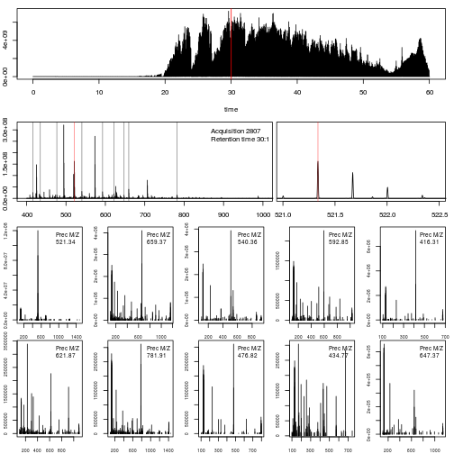

Possible material to add

TODO
- Visualisation section: use MSnExps
- Spectral counting: use MSGFplus

## Visualising raw data

The importance of flexible access to specialised data becomes visible
in the figure
below^[Figure and code taken from the `r Biocannopkg("RforProteomics")` [visualisation vignette](http://bioconductor.org/packages/release/data/experiment/vignettes/RforProteomics/inst/doc/RProtVis.html)]. Not
only can we access specific data and understand/visualise them, but we
can transverse all the data and extracted/visualise/understand
structured slices of data.



In this code chunks we start by selecting relevant spectra of
interest. We will focus on the first MS1 spectrum acquired after 30
minutes of retention time.


```{r pxd1}
## (1) Open raw data file
ms <- openMSfile(mzf)
## (2) Extract the header information
hd <- header(ms)
## (3) MS1 spectra indices
ms1 <- which(hd$msLevel == 1)
## (4) Select MS1 spectra with retention time between 30 and 35 minutes
rtsel <- hd$retentionTime[ms1] / 60 > 30 & hd$retentionTime[ms1] / 60 < 35
## (5) Indices of the 1st and 2nd MS1 spectra after 30 minutes
i <- ms1[which(rtsel)][1]
j <- ms1[which(rtsel)][2]
## (6) Interleaved MS2 spectra
ms2 <- (i+1):(j-1)
```

Now now extract and plot all relevant information:

1. The upper panel represents the chromatogram of the `r fileName(ms)`
   raw data file, produced by plotting the data returned by the
   `chromatogram` function.


```{r visfig01, fig.cap = "A chromatogram."}
plot(chromatogram(ms)[[1]], type = "l")
```

2. We concentrate at a specific retention time,
   `r formatRt(hd[i, "retentionTime"])` minutes (`r hd[i, "retentionTime"]` seconds)

```{r visfig02, fig.cap = "A chromatogram with highlighted retention time of interest."}
plot(chromatogram(ms)[[1]], type = "l")
abline(v = hd[i, "retentionTime"]/60, col = "red")
```

3. This corresponds to the `r i`th MS1 spectrum, shown on the second
   row of figures.

```{r visfig03, fig.cap = "The MS1 spectrum at the retention time of interest."}
plot(peaks(ms, i), type = "l", xlim = c(400, 1000))
legend("topright", bty = "n",
       legend = paste0(
           "Acquisition ", hd[i, "acquisitionNum"],  "\n",
           "Retention time ", formatRt(hd[i, "retentionTime"])))
```

4. The ions that were selected for MS2 are highlighted by vertical
   lines. These are represented in the bottom part of the figure.

```{r visfig04, fig.cap = "The MS1 spectrum at the retention time of interest, highlighting the peptides selected for MS2."}
plot(peaks(ms, i), type = "l", xlim = c(400, 1000))
legend("topright", bty = "n",
       legend = paste0(
           "Acquisition ", hd[i, "acquisitionNum"],  "\n",
           "Retention time ", formatRt(hd[i, "retentionTime"])))
abline(v = hd[ms2, "precursorMZ"],
       col = c("#FF000080",
           rep("#12121280", 9)))
```

5. On the right, we zoom on the isotopic envelope of one peptide in
   particular (the one highlighted with a red line).

```{r visfig05, fig.cap = "Isotopic envelope of a peptide."}
plot(peaks(ms, i), type = "l", xlim = c(521, 522.5))
abline(v = hd[ms2, "precursorMZ"], col = "#FF000080")
```

6. A final loop through the relevant MS2 spectra plots the
   `length(ms2)` MS2 spectra highlighted above.

```{r visfig06, fig.width = 8, fig.height = 10, fig.cap = "MS2 spectra of all selected precursors from the previous MS1 spectrum."}
par(mfrow = c(5, 2), mar = c(2, 2, 0, 1))
for (ii in ms2) {
    p <- peaks(ms, ii)
    plot(p, xlab = "", ylab = "", type = "h", cex.axis = .6)
    legend("topright", legend = paste0("Prec M/Z\n",
                           round(hd[ii, "precursorMZ"], 2)),
           bty = "n", cex = .8)
}
```

```{r mslayout, echo=FALSE}
## Preparing the layout (not shown)
lout <- matrix(NA, ncol = 10, nrow = 8)
lout[1:2, ] <- 1
for (ii in 3:4)
    lout[ii, ] <- c(2, 2, 2, 2, 2, 2, 3, 3, 3, 3)
lout[5, ] <- rep(4:8, each = 2)
lout[6, ] <- rep(4:8, each = 2)
lout[7, ] <- rep(9:13, each = 2)
lout[8, ] <- rep(9:13, each = 2)
```

Putting it all together:

```{r visfig, fig.cap = "Visual summary of a full round of MS1 and MS2 acquisition for specific MS1 spectrum."}
layout(lout)
par(mar=c(4,2,1,1))

plot(chromatogram(ms)[[1]], type = "l")
abline(v = hd[i, "retentionTime"]/60, col = "red")
par(mar = c(3, 2, 1, 0))
plot(peaks(ms, i), type = "l", xlim = c(400, 1000))
legend("topright", bty = "n",
       legend = paste0(
           "Acquisition ", hd[i, "acquisitionNum"],  "\n",
           "Retention time ", formatRt(hd[i, "retentionTime"])))
abline(h = 0)
abline(v = hd[ms2, "precursorMZ"],
       col = c("#FF000080",
           rep("#12121280", 9)))

par(mar = c(3, 0.5, 1, 1))
plot(peaks(ms, i), type = "l", xlim = c(521, 522.5),
     yaxt = "n")
abline(h = 0)
abline(v = hd[ms2, "precursorMZ"], col = "#FF000080")

par(mar = c(2, 2, 0, 1))
for (ii in ms2) {
    p <- peaks(ms, ii)
    plot(p, xlab = "", ylab = "", type = "h", cex.axis = .6)
    legend("topright", legend = paste0("Prec M/Z\n",
                           round(hd[ii, "precursorMZ"], 2)),
           bty = "n", cex = .8)
}
```


## A spectral counting example

Authors: Laurent Gatto and Vlad Petyuk


A longer, more comprehensive example illustrating a spectral counting
analysis pipeline, from data access to statistical analyses.


```{r env, echo=FALSE, message=FALSE}
library("rpx")
library("jsonlite")
library("R.utils")
library("Biostrings")
library("rTANDEM")
library("parallel")
library("dplyr")
library("ggplot2")
library("MSnbase")
library("MSnID")
library("msmsEDA")
library("msmsTests")
library("Heatplus")
```
### Introduction

This vignette demonstrates a real-world example of using R for
proteomics data processing, starting from download of raw data and
FASTA files with the `r Biocpkg("rpx")` package, peptide and protein
identification with X!Tandem and `r Biocpkg("rTANDEM")`, filtering
MS/MS data with `r Biocpkg("MSnID")` and statistical analysis of
spectral counts with `r Biocpkg("msmsTests")`.

### Getting the data

```{r idex1, message=FALSE}
library("rpx")
id <- "PXD002161"
px <- PXDataset(id)
try(setInternet2(FALSE), silent=TRUE)
library("jsonlite")
addr <- "http://www.ebi.ac.uk:80/pride/ws/archive/%s/list/project/%s"
files <- fromJSON(sprintf(addr, "file", id))$list
assays <- fromJSON(sprintf(addr, "assay", id))$list

files <- subset(files, fileType == 'PEAK',
                select = c("assayAccession","fileName"))

assays <- assays[,c("assayAccession",
                    "experimentalFactor",
                    "proteinCount",
                    "peptideCount",
                    "uniquePeptideCount",
                    "identifiedSpectrumCount",
                    "totalSpectrumCount")]

pttrn <- "Age: young, Diet; fully fed"
assays <- subset(assays, grepl(pttrn, experimentalFactor, fixed=T))
# encode phenotype and sample names
group <- sub(".*Name: Y-(.+?)-FF\\.(\\d)", "\\1", assays$experimentalFactor)
splnm <- sub(".*Name: Y-(.+?)-FF\\.(\\d)", "\\1_\\2", assays$experimentalFactor)

assays <- with(assays, {data.frame(assayAccession,
                                   phenotype=sub(".*Name: Y-(.+?)-FF\\.(\\d)",
                                                 "\\1", experimentalFactor),
                                   sampleName=sub(".*Name: Y-(.+?)-FF\\.(\\d)",
                                                  "\\1_\\2", experimentalFactor),
                                   stringsAsFactors=F)})
files <- subset(files, assayAccession %in% assays$assayAccession)

## c_elegans_A_3_1_21Apr10_Draco_10-03-04.mzML
## c_elegans_A_3_3_21Apr10_Draco_10-03-04.mzML
## c_elegans_B_2_1_21Apr10_Draco_10-03-05.mzML
## c_elegans_B_2_3_21Apr10_Draco_10-03-05.mzML
## c_elegans_C_1_1_21Apr10_Draco_10-03-06.mzML
## c_elegans_C_1_3_21Apr10_Draco_10-03-06.mzML
## c_elegans_D_1_1_21Apr10_Draco_10-03-07.mzML
## c_elegans_D_1_3_21Apr10_Draco_10-03-07.mzML
## c_elegans_E_3_1_21Apr10_Draco_10-03-04.mzML
## c_elegans_E_3_3_21Apr10_Draco_10-03-04.mzML

## do we already have all files?
allfiles <- length(dir(pattern = "c_elegans_.*mzML")) == 10

if (!allfiles)
    pxget(px, files$fileName) # fetch them from PX

files$datasetName <- sub('.mzML.gz','', files$fileName, fixed=TRUE)
meta <- merge(files[,c("assayAccession","datasetName")], assays)
rownames(meta) <- meta$datasetName
meta <- meta[order(meta$sampleName),]
rownames(meta) <- NULL

if (!allfiles) {
    library("R.utils")
    sapply(list.files(pattern = "mzML.gz"), gunzip)
}
```

Now we have `*.mzML` files for MS/MS search. Let's download
FASTA file from the current release of the Wormbase. We will leverage
Bioconductor's `r Biocpkg("Biostrings")` package to reverse the protein
sequence and append them to the original FASTA file. The reverse
sequences will be use for estimate of the false discovery rate of
peptide-to-spectrum matches, peptide and protein identifications.


```{r idex2, eval=FALSE}
library("Biostrings")
fasta_location <-  "ftp://ftp.wormbase.org/pub/wormbase/releases/WS250/species/c_elegans/PRJNA13758/c_elegans.PRJNA13758.WS250.protein.fa.gz"
fwd.seqs <- readAAStringSet(fasta_location, format="fasta",
                            nrec=-1L, skip=0L, use.names=TRUE)
rev.seqs <- reverse(fwd.seqs)
names(rev.seqs) <- paste("XXX", names(rev.seqs), sep='_')
fwd.rev.seqs <- append( fwd.seqs, rev.seqs)
writeXStringSet(x=fwd.rev.seqs, filepath="c_elegans_fwd_rev.fasta", format="fasta")
```

### Peptide identification

Setting up X!Tandem parameter files.

```{r idex3}
library("rTANDEM")
param <- setParamOrbitrap()
taxonomy <- rTTaxo(taxon="celegans",
                   format="peptide",
                   URL= "c_elegans_fwd_rev.fasta")
param <- setParamValue(param, 'list path', 'taxonomy information', taxonomy)
param <- setParamValue(param, 'protein', 'taxon', value='celegans')

def.input.path <- system.file("extdata/default_input.xml", package="rTANDEM")
param <- setParamValue(param, 'list path', 'default parameters',
                       value=def.input.path)

param <- setParamValue(param, "output", "message", "r-for-proteomics ")
param <- setParamValue(param, "refine", value="no")
```

Note, we will be executing X!Tandem on all available cores on the
computer. To determine the number of cores we leverage
`detectCores()` function from the \CRANpkg{parallel}
package.

```{r expar}
library("parallel")
param <- setParamValue(param, "spectrum", "threads", detectCores())
```

Actuall excetion of the X!Tandem searches. As the output we will
capture the names of corresponging XML files with the MS/MS search
results.


```{r rtout}
output.files <-
    lapply(sub("\\.gz","",files$fileName),
           function(x) {
               param <- setParamValue(param, 'spectrum', 'path', value=x)
               output.file <- tandem(param)
           })
```

Since X!Tandem reports the results in its own XML format, parsing then
is a little bit involved process. As we mentioned above, fortunately,
the most recent version of (X!Tandem)[http://www.thegpm.org/tandem/]
PILEDRIVER (2015.04.01) is capable of producing results in `mzIdentML`
format. Then extracting the results will be trivial with the help of
`r Biocpkg("mzID")` package. The change will be probably caught up in
the upcoming versions of the `r Biocpkg("rTANDEM")` package. However,
at this point we will use a custom function that produces a
`data.frame` with all the necessary columns. The columns that are
required for the `r Biocpkg("MSnIDP")` package to create an MS/MS
identification object are: accession, calculatedMassToCharge,
chargeState, experimentalMassToCharge, isDecoy, peptide, spectrumFile
and spectrumID.


```{r xttodf, warning=FALSE, message=FALSE}
library("dplyr")
.P <- MSnID:::.PROTON_MASS # 1.007276

## parse to comply with MSnID
xtandem_to_df <- function(output.file){
    res <- GetResultsFromXML(output.file)
    proteins <- GetProteins(res)
    peptides <- GetPeptides(protein.uid = proteins$uid, results = res)
    peptides <- select(as.data.frame(res@peptides),
                       prot.uid, spectrum.mh, mh, expect.value,
                       tandem.score, start.position, end.position,
                       spectrumID = spectrum.id,
                       chargeState = spectrum.z,
                       pepSeq = sequence)
    peptides <- mutate(peptides,
                       calculatedMassToCharge = (mh + .P*(chargeState - 1))/chargeState,
                       experimentalMassToCharge = (spectrum.mh + .P*(chargeState - 1))/chargeState,
                       spectrum.mh = NULL,
                       mh = NULL)
    proteins <- select(as.data.frame(res@proteins),
                       prot.uid=uid, sequence, description)
    proteins <- mutate(proteins,
                       accession = sub("(\\S+)\t.*", "\\1", description),
                       isDecoy = grepl("XXX_", accession))
    x <- inner_join(peptides, proteins)
    pre <- with(x, substr(sequence, start.position-1, start.position-1))
    pre <- ifelse(pre == "", "-", pre)
    post <- with(x, substr(sequence, end.position+1, end.position+1))
    post <- ifelse(post == "", "-", post)
    x <- mutate(x,
                peptide = paste(pre,x$pepSeq, post, sep='.'),
                sequence = NULL)
    return(x)
}

out <- lapply(output.files, xtandem_to_df)
for(i in seq_along(out))
    out[[i]]$spectrumFile <- sub("\\.mzML\\.gz","",files$fileName)[i]
out <- Reduce(rbind, out)
```

### Filtering identification data

The *MSnID* class object from the library of the same name
allows flexible manipulation and filterting of MS/MS identification
results data.

```{r msnidm}
library(MSnID)
m <- MSnID()
psms(m) <- out
show(m)
```

Let's take a look and mass measurement error and a large scale. Some
peptide-to-spectrum matches have the error as large as +1 and +2
Dalton. This is due to the fact that the instrument sometime picks
non-monoisotopic peaks for fragmentation. This is more common for the
peptides with large mass.


```{r msnisfig, fig.cap = "Isotope selection error before and after correction."}
library("ggplot2")
dM <- with(psms(m),
           round((experimentalMassToCharge-calculatedMassToCharge)*chargeState))
x <- as.data.frame(table(data.frame(dM, isDecoy=m$isDecoy)))
x <- as.data.frame(table(dM, isDecoy=m$isDecoy))
ggplot(x, aes(x=dM, fill=isDecoy, y=Freq)) +
    geom_bar(stat="identity", width=0.25)
```

For correction of the parent ion mass at the isotope-scale level there
is a method with the corresponding name `correct_peak_selection()`.

```{r correctpeaksel, fig.with=6, fig.height=6}
m <- correct_peak_selection(m)
dM <- with(psms(m),
           round((experimentalMassToCharge-calculatedMassToCharge)*chargeState))
x <- as.data.frame(table(data.frame(dM, isDecoy=m$isDecoy)))
x <- as.data.frame(table(dM, isDecoy=m$isDecoy))
ggplot(x, aes(x=dM, fill=isDecoy, y=Freq)) +
    geom_bar(stat="identity", width=0.25)
```


The mass measurement error at a finer grain, typicaly related to the
mis-calibrated instument, can be accessed with
`mass_measurement_error` method.

```{r parentionmass, fig.cap = "Parent ion mass measurement error histograms for non-decoy and decoy peptide-to-spectrum matches"}
mme <- data.frame(ppm=mass_measurement_error(m), isDecoy=m$isDecoy)
ggplot(mme, aes(x=ppm, fill=isDecoy)) +
    geom_histogram(binwidth=1) +
    xlim(-20,+20) +
    facet_wrap( ~ isDecoy) +
    scale_y_sqrt()
```


Finding the right set of filtering criteria for MS/MS data is not a
trivial task. For the purpose of flexible filter optimization the
`r Biocpkg("MSnID")` package has the *MSnIDFilter* class. We will
start with defining the criteria we want to filter on.

```{r msnidfilt}
m$score <- -log10(m$expect.value) # higher the better
m$mme <- abs(mass_measurement_error(m)) # lower the better
fltr <- MSnIDFilter(m)
```

Let define some starting values. What is important is to define what
should be retained higher or lower the given threshold.  Threshold
itself can be set to arbitrary value if "Grid" optimization method
will be used as a first pass. "Grid" optimization loops through a
preset number (`n.iter` argument) of combinations of thresholds
ignoring the initial values. In the filtering criteria optimization
routines, the objective function is the number of peptide-to-spectrum
matches, peptide or protein identifications defined by the
`level` argument. However, if the FDR (estimated using reverse
sequences) exceeds the pre-defined maxium value, the objective
function sets to zero.

```{r }
fltr$score <- list(comparison=">", threshold=0)
fltr$mme <- list(comparison="<", threshold=0)
fltr.grid <- optimize_filter(fltr, m, fdr.max=0.01,
method="Grid", level="peptide",
n.iter=1000)
show(fltr.grid)
```

```{r }
as.numeric(fltr.grid)
evaluate_filter(m, fltr.grid)
```


Further fine-tuning of the filtering criteria can be approached with
Nelder-Mead or simulated annealing optimization techniques specified
by the `method` arugment.


```{r filtsann, cache=TRUE}
fltr.sann <- optimize_filter(fltr.grid, m, fdr.max=0.01,
method="SANN", level="peptide",
n.iter=1000)
show(fltr.sann)
as.numeric(fltr.sann)
evaluate_filter(m, fltr.sann)
```

Applying the filter.

```{r applsann}
m <- apply_filter(m, fltr.sann)
```


Visualizing the number of peptides covering the proteins.

```{r nbidpeps, fig.cap = "Number of identified peptides per protein. Almost half of the proteins are 'single-hit wonders', i.e. they have been identified with one peptide only."}
pp <- unique(psms(m)[,c("peptide","accession")])
pep_per_prot <- as.data.frame(table(table(pp$accession)))
pep_per_prot$peptides <- with(pep_per_prot,
                              ifelse(as.numeric(Var1) > 5, "6+", as.numeric(Var1)))
ggplot(pep_per_prot,
       aes(x=factor(1), fill=peptides, y=Freq)) +
    geom_bar(width=1, stat = "identity", position = "stack") +
    coord_polar(theta = "y") +
    ylab('') + xlab('') +
    scale_fill_discrete(name="number of\npeptides per\nprotein")
```


Filtering out single-hit-wonders (that is proteins covered with only
one peptide). Note the massive drop in FDR (down to 0\%). Therefore, if
this particular path of filtering MS/MS identifications seems
stringent the steps can be easily flipped around in the script or
re-arranged in any other way that produce the results suitable for a
particular application.

```{r applflitbigex}
nms <- names(which(table(pp$accession) > 1))
m <- apply_filter(m, "accession %in% nms")
show(m)
```


### Exploratory data analysis

We continue using the `MSnID` object results from X!Tandem
searches of 10 *C. elegans* files. First, we will convert it to
an `MSnSet` object that is more taylored to quantitative
analysis and explore the data using the `r Biocpkg("msmsEDA")` package.

```{r }
mset <- as(m, "MSnSet")
show(mset)
```


Summing up peptide counts to protein (or assession in general terms)
level. The redundancy of peptide to protein mapping is controlled by
the `redundancy.handler` argument. In this case we will use
only uniquely mapping peptides for protein quantification.


```{r cmbfeats}
library("MSnbase")
mset <- combineFeatures(mset,
                        fData(mset)$accession,
                        redundancy.handler="unique",
                        fun="sum",
                        cv=FALSE)
show(mset)
```

Subsetting to the ones that were detected in at least half of the samples

```{r filt}
mset <- mset[rowSums(exprs(mset) > 0) >= 6, ]
```

Updating `phenoData` using the meta-information on experimental
designed fetched
from
[ProteomeXchange project page](http://www.ebi.ac.uk/pride/archive/projects/PXD002161).

```{r prep}
pData(mset) <- meta[match(sampleNames(mset), meta$datasetName),]
mset$phenotype <- as.factor(mset$phenotype)
sampleNames(mset) <- mset$sampleName
pData(mset)
```

The PCA plot below shows clear separation of control and *daf-2*
mutant *C. elegans* strains.


```{r scpca, fig.cap = "Clear separation of control and daf-2 strains on PCA plot indicates on substantial difference in proteome composition."}
library("msmsEDA")
counts.pca(mset,
           facs = pData(mset)[,'phenotype',drop=FALSE],
           snms = sampleNames(mset))
```


### Statistical analysis

Null hypothesis significance testing using quasi-likelihood Poisson
approach from the `r Biocpkg("msmsTests")` package. The p-value histogram
shows a substantial increase of p-value frequency in low-value bins
(tailing-up), indicating a significant proteome difference between the
strains.


```{r phist, fig.cap = "Histogram of p-values."}
library("msmsTests")
alt.f <- "y ~ phenotype"
null.f <- "y ~ 1"
div <- colSums(exprs(mset)) # normalization factor
res <- msms.glm.qlll(mset, "y ~ phenotype", "y ~ 1", div=div)
hist(res$p.value, 100)
```

A volcano plot is an alternative way to visualize the estimate fold
and significance of change of change.

```{r scvolc, fig.cap = "Volcano plot"}
lst <- test.results(res, mset, pData(mset)$phenotype,
                    "ctrl", "daf2", div, alpha = 0.05,
                    minSpC = 0, minLFC = 1, method = "BH")
res.volcanoplot(lst$tres, min.LFC = 1,
                max.pval = 0.05, ylbls = NULL, maxy = 4)
```


Finally, we use a heatmap to visualize relative protein abundances
across the study samples. In this example we will subset the proteins
only to the ones that have a fold change (up or down) more then 2-fold
and pass the 0.05 threshold for the adjusted p-value.

```{r hmap, fig.cap = "Heatmap of top proteins."}
library("Heatplus")
regulated <- subset(lst$tres, adjp < 0.05 & abs(LogFC) > 1)
## order MSnSet object the daf-16 status
mset <- mset[,order(pData(mset)$phenotype)]
## matrix with regulated proteins
selected.data <- exprs(mset[rownames(regulated),])
## scaling counts from 0 to 1
selected.data <- sweep(selected.data, 1, apply(selected.data, 1, min), '-')
selected.data <- sweep(selected.data, 1, apply(selected.data, 1, max), '/')
heatmap_plus(selected.data,
             scale='none',
             col=colorRampPalette(c("snow","steelblue"))(10))
```

### Session information {-}

```{r si}
sessionInfo()
```
